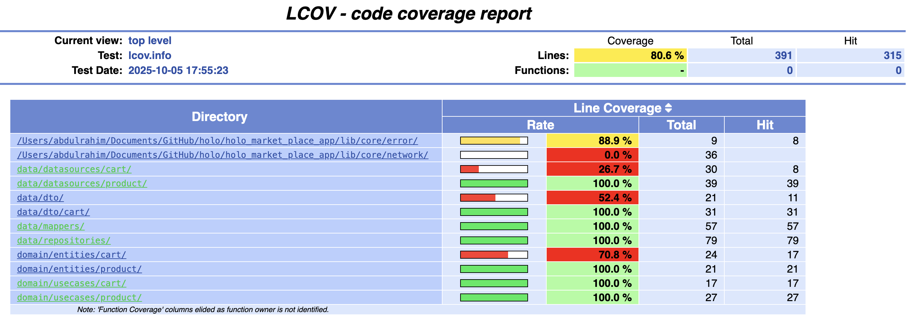
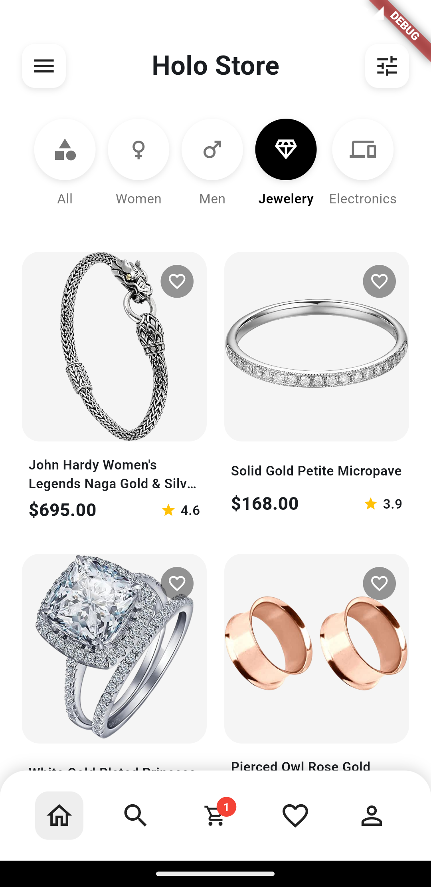

# Holo Marketplace App

A modern, scalable, and well-tested e-commerce Flutter application built with Clean Architecture principles. This project serves as a robust template for building feature-rich marketplace apps.

## Features
This app is implemented with Clean Architecture + Cubit state management pattern.

- **Product Discovery**: Browse a list of all available products.
- **Categorization**: Filter products by categories.
- **Product Details**: View detailed information for each product.
- **Shopping Cart**: Add, update, and remove items from the cart.
- **Dark Mode**: Seamless theme switching for a better user experience.
- **Local Caching**: Offline-first approach for cart items, ensuring a fast and responsive UI.


## System Overview

```
┌────────────────────────────────────────────────┐
│      USER INTERFACE - (Presentation Layer)     │
└────────────────────────────────────────────────┘
                        │
                        ▼
┌────────────────────────────────────────────────┐
│      STATE MANAGEMENT - (Cubit Layer)          │
└────────────────────────────────────────────────┘
                        │
                        ▼
┌────────────────────────────────────────────────┐
│      DOMAIN ENTITIES - (Business Logic)        │
└────────────────────────────────────────────────┘
                        │
                        ▼
┌────────────────────────────────────────────────┐
│      DATA ENTITIES - (Data Retrieving Logic)   │
└────────────────────────────────────────────────┘
```

---
## Architecture Overview

### **1. Features Layer (Clean Architecture)**

#### **Domain Layer** (Business Logic)
- **Entities**: Pure Dart classes (Product)
- **Repositories**: Abstract interfaces
- No dependencies on outer layers

#### **Data Layer** (Implementation)
- **Models**: JSON serialization
- **Data Sources**: API communication
- **Repository Implementation**: Converts models to entities

#### **Presentation Layer** (UI)
- **Cubit**: State management
- **States**: Loading, Loaded, Error
- **Pages**: Main screens
- **Widgets**: Reusable UI components


### **2. Core Layer**
- **API Client**: Handles HTTP requests with error handling
- **Constants**: Centralized API endpoints
- **Failures & Exceptions**: Custom error handling
- **DI**: GetIt service locator setup

---

## Libraries Used

```yaml
dependencies:
  flutter_bloc: ^8.1.3      # State management
  equatable: ^2.0.5         # Value equality
  get_it: ^7.2.0            # Dependency injection
  http: ^1.2.0              # HTTP client
  dartz: ^0.10.1            # Functional programming (Either)
  cached_network_image      # Image caching
  shared_preferences        # Local storage
  flutter_launcher_icons    # App Icon generator
  mockito: ^5.4.2           # Unit Testing
  build_runner: ^2.4.6      # Mock generator
```
---

### Technical Stack

-   **State Management**: `flutter_bloc` for predictable and scalable state management.
-   **Functional Programming**: `dartz` to handle errors and exceptions gracefully using `Either`.
-   **Networking**: `http` for making API calls.
-   **Local Storage**: `shared_preferences` for caching cart data. An in-memory cache is used for products and categories.
-   **Testing**: `mockito` and `build_runner` for generating mock objects for unit tests.
-   **Image Loading**: `cached_network_image` for efficient loading and caching of network images.

---
## Key Features Implemented

### 1. Product List
- Fetches products from `FakeStoreAPI`
- Displays in 2-column grid
- Shows: image, title, price, category, rating
- Pull-to-refresh

### 2. Category Filtering
- Dynamic categories from API
- "All Items" + men's/women's clothing, jewelery, electronics
- Filter products with icons
- Real-time filtering

### 3. Error Handling
- Network errors
- Server errors
- Retry functionality
- User-friendly error messages

### 4. Loading States
- Custom shimmer loading animation
- Smooth transitions
- No jarring state changes

### 5. Modern UI/UX
- Clean, minimal design
- Rounded corners
- White cards with shadows
- Black accent color
- Bottom navigation bar

### 6. Dark and Light Themes
- Seamlessly switches modes
- Adapts to system's theme
- Consistent and eye-friendly UI

---

## Code Quality & Best Practices Followed
- SOLID principles
- Clean Architecture
- Dependency Injection
- Error handling
- Loading states
- Consistent naming
- Organized structure
- Commented code
- Type safety
---

## Testing

The project has a strong emphasis on business logic testing, with a comprehensive suite of unit tests.

### Running Tests

To run all unit tests, execute the following command:
```sh
flutter test --coverage
```

### Test Coverage



To generate a full test coverage report, use the provided script. This will generate mocks, run the tests and generate an HTML report in the `coverage/html` directory using [LCov](https://github.com/linux-test-project/lcov).

```sh
./test_coverage.sh
```

---
## Screenshots

| Product List  | Detail Page | Cart with Items | Empty Cart |
| ------------- |:-------------:|:-------------:| :-------------:|
|  |  |  |  | 
|  |  |  |  | 
---

## Design reference:
- [Mobile eCommerce Clothing Store App Design (Community)](https://www.figma.com/design/SqaelA9NWl8py91Yu7B3vV/Mobile-eCommerce-Clothing-Store-App-Design--Community-?node-id=1-3&p=f&t=6n2b5IACEGYyYBLa-0)
- [FluxStore (Community)](https://www.figma.com/design/6cVJi1oPKMCZKjIy8CKojz/FluxStore--Community-?node-id=0-1&p=f&t=tyyxHkJCEw9yhkqg-0)

### Sets to run project

1.  **Clone the repository:**
    ```sh
    git clone https://github.com/tjabid/holo_market_place_app.git
    cd holo_market_place_app
    ```

2.  **Install dependencies:**
    ```sh
    flutter pub get
    ```

3.  **Generate Mocks for Tests:**
    Before running tests, you need to generate the necessary mock files.
    ```sh
    # For macOS/Linux
    ./generate_mocks.sh

    # For Windows
    .\generate_mocks.bat
    ```

4.  **Run the application:**
    ```sh
    flutter run
    ```

---

## Exmaple Overview of Product Feature

### Data Flow

```
UI (Widget)
    ↓
BlocBuilder watches ProductsCubit
    ↓
ProductsCubit emits ProductsState
    ↓
Cubit calls GetProductsUseCase
    ↓
Use Case calls ProductRepository
    ↓
Repository calls RemoteDataSource
    ↓
DataSource uses ApiClient
    ↓
API returns JSON
    ↓
Model converts JSON to Entity
    ↓
Repository returns Either<Failure, Entity>
    ↓
Cubit emits new state (Loading/Loaded/Error)
    ↓
UI rebuilds with new data
```

---

### State Management Pattern - Product

#### **Products State Hierarchy**
```dart
ProductsState (abstract)
├── ProductsInitial
├── ProductsLoading
├── ProductsLoaded
│   ├── products: List<Product>
│   ├── categories: List<String>
│   └── selectedCategory: String?
└── ProductsError
    └── message: String
```
---


### Add Ons Features
- Search Feature
- Favorites
- Lottie animations 
- User & Orders

## Further Reading

- [Flutter BLoC Documentation](https://bloclibrary.dev/)
- [Clean Architecture by Uncle Bob](https://blog.cleancoder.com/uncle-bob/2012/08/13/the-clean-architecture.html)
- [GetIt Documentation](https://pub.dev/packages/get_it)
- [Dartz Functional Programming](https://pub.dev/packages/dartz)
- [Mockito](https://pub.dev/packages/mockito)
- [LCov](https://github.com/linux-test-project/lcov)
